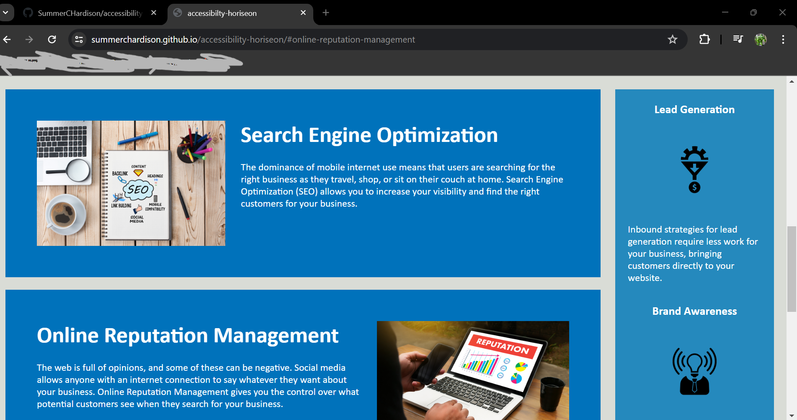

# accessibility-horiseon

## Description

This project is a web application about accessibilty, managing web resources, and optimization of those resources. It was created as a way to practice debugging, styling, and using semantic elements in both CSS and HTML. The challenge simulated being hired by a company to help develop the web application

# To application

[https://summerchardison.github.io/accessibility-horiseon/](https://summerchardison.github.io/accessibility-horiseon/)

# Credits
Summer Hardison

Starter code provided by staff at UNC-charlotte
